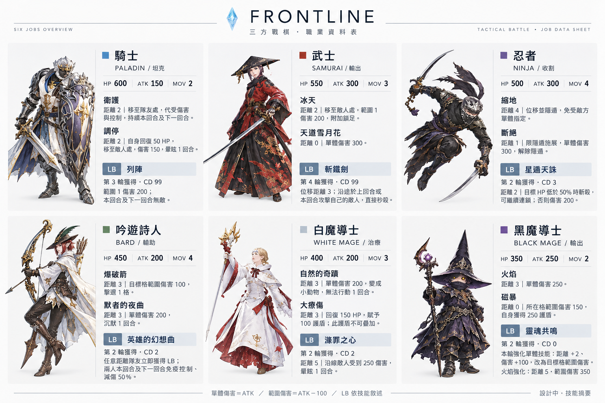

# Frontline — 三方戰棋桌遊

三個陣營在一張三角形地圖上爭奪控制點的桌遊，3～12 人，五輪決勝。
每一輪所有人**同時秘密排出 5 張行動卡**，再一張一張同步翻開結算——所以真正的較量不是「我要打誰」，而是猜對手會在第幾個回合出手。
分數來自佔領據點而不是擊殺，攻擊的價值在於**打斷對方的得分**。

以 FINAL FANTASY XIV 的 Frontline 大規模 PvP 為靈感。

## 檔案

| 檔案 | 說明 |
|---|---|
| `rulebook.html` | 完整規則書 V4，用瀏覽器開啟即可 |
| `job-overview.png` | 六職業總覽圖（上圖） |
| `job-editor.html` | 職業資料編輯器，附即時平衡速查 |
| `jobs-backup.json` | 六個職業的資料備份 |
| `resources/` | 職業與技能圖示，依職業分資料夾（各 4 張：職業頭像＋2 技能＋LB） |

## 狀態

設計中（V4）。規則本體已經完整，可以照著打；尚未定案的項目列在規則書附錄 D，
其中最關鍵的是**地圖改版與軸線系統**——有三個技能的實際效果卡在它上面。
